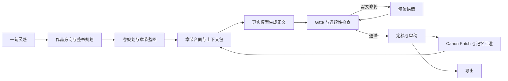

# Open Novel

> 本地优先、可审计、可接管的 AI 长篇小说生产工作台。

[](https://www.python.org/)
[](frontend/)
[](open_novel/)
[](LICENSE)

Open Novel 不是“输入一句话，AI 补一段正文”的聊天壳。它把一本长篇小说拆成作品方向、整书规划、卷与节奏段、章节合同、正文生成、审稿修复、记忆回灌和导出，并让这些环节沿同一条可暂停、可恢复的生产链持续推进。

项目采用本地文件作为作品真相源。正文、人物、世界规则、伏笔、关系、时间线和写作记忆都保存在作者自己的目录中；AI 生成内容先进入候选、草稿或审稿记录，只有经过自动流程或作者确认后才会写入正式内容。

## 为什么做 Open Novel

长篇创作真正困难的不是“生成一章”，而是几十万字之后仍然记得：

- 人物现在处于什么状态，关系为何发生变化；
- 哪些世界规则不能被后文推翻；
- 哪些伏笔、承诺和冲突需要在什么窗口兑现；
- 当前章节服务于哪一卷、哪一个节奏段和哪一条主线；
- AI 修改了什么，哪些内容已经成为正式设定。

Open Novel 把这些信息从聊天历史中拆出来，变成可查看、可编辑、可追踪的作品资产。

## 核心能力

### 一句话开书，持续推进整本小说

- 从创意、题材和目标读者出发，生成作品方向、整书架构、卷规划和章节蓝图。
- 通过全自动、阶段确认、逐章确认、深度干预四种模式控制作者参与程度。
- 支持继续生成、暂停、恢复、确认和人工接管；全自动模式带单次推进步数熔断。
- 生成任务和候选结果持久化，服务重启后可以恢复，不靠浏览器页面维持状态。

### 先规划再写作

- 每章写作前建立章节合同，明确目标、冲突、转折、结果、钩子、代价、潜台词和情绪余韵。
- 按当前章节需要构建上下文包，不把整本小说无差别塞进 Prompt。
- 作品方向、卷目标、节奏段、世界规则、人物状态、读者承诺和相关资料持续影响后续章节。

### 审稿、修复和记忆闭环

- 正文生成后执行章节 Gate、连续性检查和写作质量检查。
- 对阻断问题生成修复候选，修复后重新检查，不合格内容不会直接进入正式稿。
- 定稿后生成审稿记录和 Canon Patch，将事实、时间线、伏笔、承诺、人物与关系状态回灌到长期记忆。
- 永久禁止项同时进入后续生成约束和 Gate，避免已确认规则被再次破坏。

### 面向连载的长期经营

- 支持多卷规划、节奏段、章节落点和候选重规划。
- 提供连续弱钩子、承诺压力、节奏失衡、角色停滞和卷目标偏离等连载风险提示。
- 支持资料库、章节关联资料、关系图、时间线和长期记忆主题召回。
- 已定稿章节与未来规划分层保存，重规划不会静默覆盖正式正文。

### 写法与模型可控

- 可从外部文本提取带原文证据的写法候选，作者按候选 ID 确认后才进入正式写法记忆。
- 支持 Codex CLI、Claude Code、Qwen Code，以及本地命令式写作模型配置。
- 支持训练数据导出、本地适配器登记和五章模型对比；未通过对比门禁的模型不会自动晋升为默认模型。
- 所有 Agent 运行保留来源、状态和结果摘要，便于定位失败与复现生成过程。

### 本地优先和可恢复

- 一部小说就是一个普通文件夹，作品内容不依赖远程账号或专有云数据库。
- 提供作品备份、备份校验和恢复命令，作品文件与工作台 SQLite 状态一起迁移。
- Docker 默认只绑定本机回环地址；远程访问可启用访问令牌。
- 支持 TXT、Markdown、ZIP 成稿和训练数据导出。

## 与重型一体化平台的取向区别

Open Novel 参考了一些优秀的公开项目对“自动导演、整本生产链、世界与角色资产、写法引擎”的产品表达，但选择了更聚焦的实现边界：

| 维度 | Open Novel 的选择 |
| --- | --- |
| 产品范围 | 聚焦长篇小说主链，不把漫画、短剧和多人协作塞进当前版本 |
| 数据归属 | `.open-novel/workspace.sqlite3` 是作品与工作台数据的本地真相源 |
| 运行依赖 | 默认 Python + SQLite；不强制部署向量数据库、消息队列或云端账号体系 |
| AI 接入 | Web 工作台使用作者配置的 API 账号；命令行 Skill 可独立使用本机 CLI Agent |
| 写入安全 | 候选、草稿、审稿、Canon 与导出分层，正式内容的变化可追踪 |
| 作者控制 | 四档干预、确认点、暂停恢复和接管贯穿同一生成状态机 |

## 典型工作流



## 快速开始

### 方式一：Docker Compose

需要 Docker、Python 3.11+ 和 uv。推荐通过项目更新入口启动，它会同时启动
Docker Compose 和宿主机更新助手：

```bash
uv run python scripts/open_novel_updater.py --compose-up
```

打开 <http://127.0.0.1:8000>。Compose 默认只监听本机 `127.0.0.1`。
后续在左上角版本按钮中点击“一键更新”即可完成下载、镜像重建、容器重启、健康检查和
失败回滚，不需要手工拉取代码。停止服务使用：

```bash
uv run python scripts/open_novel_updater.py --compose-down
```

直接执行 `docker compose up --build` 仍可启动服务，但没有宿主机更新助手时，
页面会明确提示自动更新入口未就绪。应用容器不会挂载 Docker socket。

工作台的真实 AI 生成通过“模型”页配置 API 账号，不依赖容器或宿主机里的 Codex、Claude、Qwen CLI 登录环境。命令行 Skill 仍可独立使用本机 CLI Agent。

### 方式二：源码运行

环境要求：

- Python 3.11+
- [uv](https://docs.astral.sh/uv/)
- Node.js 20+
- 一个支持 Responses API 或 Chat Completions API 的模型账号，用于工作台真实 AI 生成
- 可选：Codex CLI、Claude Code 或 Qwen Code，用于独立命令行 Skill

安装依赖：

```bash
uv sync --extra dev --group dev
npm --prefix frontend ci
```

先启动后端：

```bash
uv run open-novel serve
```

再启动前端开发服务器：

```bash
npm --prefix frontend run dev -- --force
```

打开 <http://127.0.0.1:5173>。前端会把 API 请求代理到 `http://127.0.0.1:8765`。
左上角版本按钮中的一键更新会由外部更新进程接管：当前后端安全退出后替换程序、同步依赖、
重启服务并核对目标版本；新版本无法启动时自动恢复旧版本。可通过环境变量 JSON
数组 `OPEN_NOVEL_RESTART_COMMAND` 和 `OPEN_NOVEL_DEPENDENCY_COMMAND` 覆盖默认
重启及依赖同步命令。
页面会按后端返回的间隔自动检查版本；默认每分钟一次，同一后端进程内的多个页面共享
最近一次检测结果。版本面板中的手动检查按钮会立即刷新远端结果。

前端开发统一使用 Vite HMR 热更新模式，修改 React 或 CSS 后不需要反复重启。若页面仍显示旧 UI，先确认 `5173` 返回的 `/src/` 模块包含当前源码；只有监听进程与当前仓库源码失配时，才停止旧进程并使用上面的命令重新启动。

检查本机 Agent 和作品环境：

```bash
uv run open-novel agent detect
uv run python scripts/open_novel_ops.py doctor
```

## 基本使用路径

1. 打开菜单栏第一项“AI 模型”，先在“AI 账号”标签新增并拨测账号，再到同页“模型方案”分别选择写作模型和审核模型。
2. 在“书架”创建作品，填写灵感、题材、全书章节数、单章字数和剧情段章节数。
3. 在“生成”页按当前阶段完成作品方向、整书规划、章节蓝图和章节生成。
4. 遇到确认点时审阅候选；遇到阻断时查看证据、修复或接管。
5. 在“章节”查看正文和修改 AI 候选，在“资料”和“审稿”维护设定与记忆。
6. 在“AI 模型”的“AI 账号”标签查看逐次 Token、缓存和上下文压缩记录；需要本地训练时进入独立的“本地训练”菜单，并先阅读 `docs/MODEL_TRAINING_BEGINNER_GUIDE.md`。
7. 完成当前范围后，在“导出”检查未完成章节、未处理审稿和资料缺口，再生成成稿。

账号、角色、拨测、Token、缓存和上下文压缩说明见 [AI 账号与 Token 使用](docs/AI_ACCOUNTS_AND_TOKEN_USAGE.md)。

## 命令行能力

```bash
# 查看本机可用 Agent 和内置 Skill
uv run open-novel agent detect
uv run open-novel skill list

# 检查章节准备度、构建上下文并生成正文
uv run open-novel project readiness --project /path/to/novel --chapter-id 001
uv run open-novel project build-context --project /path/to/novel --chapter-id 001
uv run open-novel skill run --project /path/to/novel chapter-writer --chapter-id 001 --agent-id codex-cli

# 检查、定稿、审稿和更新记忆
uv run open-novel project chapter-gate --project /path/to/novel --chapter-id 001
uv run open-novel project accept-draft --project /path/to/novel drafts/001.generated.md --chapter-id 001
uv run open-novel project review-chapter --project /path/to/novel --chapter-id 001
uv run open-novel project apply-canon-patch --project /path/to/novel --chapter-id 001

# 导出成稿
uv run open-novel export manuscript --project /path/to/novel --format txt
```

完整命令以 CLI 自带帮助为准：

```bash
uv run open-novel --help
uv run open-novel project --help
```

## 作品目录

```text
my-novel/
├── novel.json                 # 作品元数据与配置
├── bible.md                   # 故事圣经
├── rules.md                   # 世界规则
├── outline.md                 # 大纲
├── characters/               # 人物资料
├── chapters/                 # 正式章节
├── drafts/                   # AI 草稿与修复候选
├── story/
│   ├── chapter-briefs/        # 章节合同
│   ├── context-packs/         # 可审计上下文包
│   └── branches/              # 剧情方向候选
├── memory/                    # 事实、伏笔、承诺、状态与写作记忆
├── reviews/                   # 审稿记录
├── patches/                   # Canon Patch
├── runs/                      # Agent 运行证据
├── models/                    # 写作与审稿模型配置
└── exports/                   # 导出成稿
```

原则只有一条：生成内容先进入候选层，正式正文和记忆只通过明确的接受或应用流程更新。

## 备份与恢复

```bash
# 备份作品文件和对应工作台状态
uv run python scripts/open_novel_ops.py backup \
  --project /path/to/novel \
  --output /path/to/novel-backup.onovel.zip

# 校验备份
uv run python scripts/open_novel_ops.py verify-backup \
  --backup /path/to/novel-backup.onovel.zip

# 恢复到空目录
uv run python scripts/open_novel_ops.py restore \
  --backup /path/to/novel-backup.onovel.zip \
  --destination /path/to/restored-novel
```

升级或调整模型前，建议先生成并校验备份。不要直接覆盖唯一一份作者数据。

## 远程部署边界

- Open Novel 当前按本地单用户、单进程、单副本设计，不支持多个 worker 或多个副本同时写同一数据目录。
- Docker 默认只绑定 `127.0.0.1:8000`。不要把未鉴权端口直接暴露到局域网或公网。
- 需要远程访问时设置 `OPEN_NOVEL_ACCESS_TOKEN`；公网还必须通过 nginx、Caddy 等反向代理启用 TLS。

```bash
export OPEN_NOVEL_ACCESS_TOKEN='替换为足够长的随机令牌'
uv run python scripts/open_novel_updater.py --compose-up
```

设置令牌后，浏览器登录框的用户名可任意填写，密码填写该令牌；API 可使用 `Authorization: Bearer <token>` 或 `X-Open-Novel-Token`。

## 当前状态与边界

当前版本为 `0.1.4`，支持源码单机与 Docker Compose 部署。使用时仍需明确以下边界：

- 质量分数目前只提供风险参考，不作为自动定稿的硬阈值。
- 实际正文质量取决于所选模型、题材资料和作者审阅，测试通过不等于任何模型都能稳定产出可发布正文。
- 工作台逐次记录输入、输出、缓存输入、推理和总 Token；上游未返回 usage 时标记为本地估算。当前不维护供应商价格表，因此不计算人民币成本。
- 系统不是多租户平台，不提供账号、RBAC、多 worker 或多副本共享写入。

## 开发与发布验证

```bash
uv run pytest -q
uv run ruff check .
npm --prefix frontend run check
uv run python scripts/package_check.py
uv run python scripts/release_check.py
```

发布检查会运行后端测试与静态检查、构建 React 前端、校验 Python 包内容，并执行最终章节验收。更新包构建还会排除本地数据库、环境变量、AI 密钥文件和开发运行产物，并在生成后检查本机绝对路径、常见访问令牌及私钥，命中时终止发布。

## 开源协议

Open Novel 使用 [Apache License 2.0](LICENSE)。
